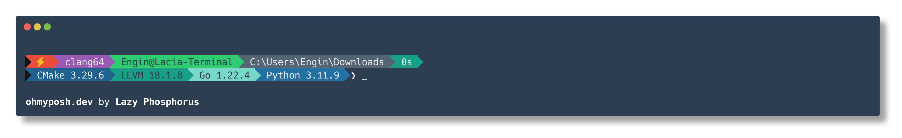
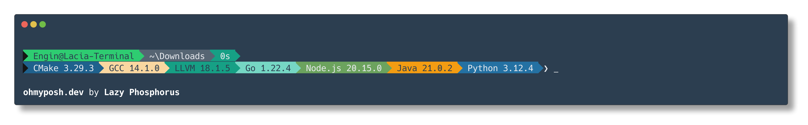

# SHELL-LP





This repository is a customized theme of [Oh My Posh](https://ohmyposh.dev/).

## Prequisite

[BusyBox](https://www.busybox.net/) should be correctly installed if you want to use this theme on Windows.

## Usage

Clone the files of this repository into correct PowerShell profile directory which can be checked by the command below.

```pwsh
Split-Path $PROFILE
```

## MSYS2 Usage

To use oh-my-posh in msys2 bash, you should install oh-my-posh in Windows and add the commands below into your `~/.bashrc` file.

```shell
export PATH=$PATH:/c/Users/[your username]/AppData/Local/Programs/oh-my-posh/bin
export MSYS_ENV=${MSYSTEM_PREFIX:1}
eval "$(oh-my-posh init bash --config '/path/to/posh.json')"
```

If you don't know where the oh-my-posh binary is, use `where.exe` command to find it.

```pwsh
where.exe oh-my-posh
```
